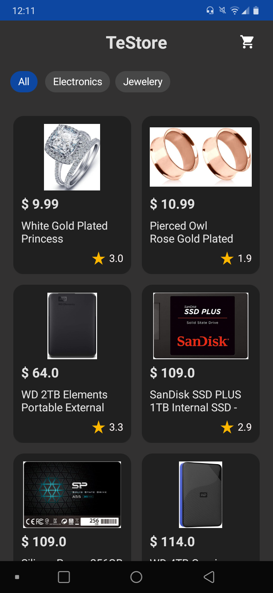
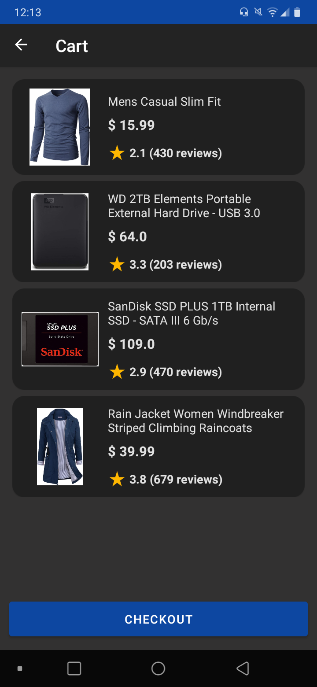
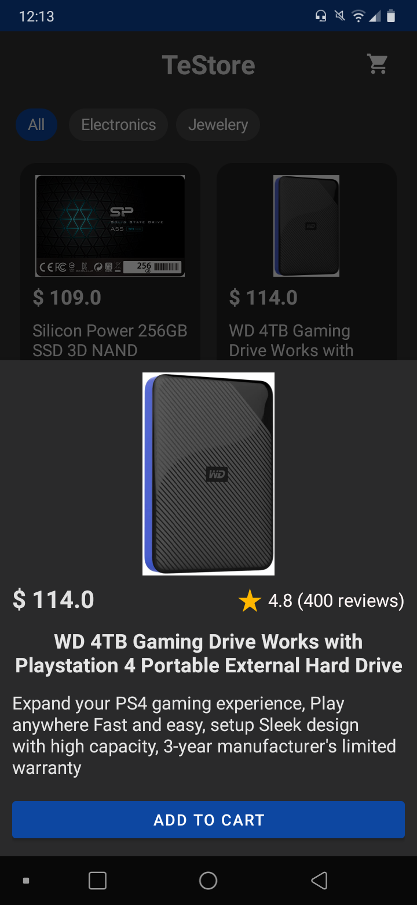

  
  
  

# Objetivo

Projeto focado em estudos de testes unitários e instrumentados no Android.

O objetivo não é o design nem as funções do app em si, mas apenas os testes, por isso essas coisas podem deixar a desejar. Apesar disso, tentei criar uma interface minimamente agradável.

É utilizada a biblioteca [Truth](https://github.com/google/truth) para melhor legibilidade nos testes.

O projeto faz consumo da [Fake Store API](https://fakestoreapi.com) para obter dados remotos, além de utilizar o [Navigation Component](https://developer.android.com/guide/navigation/navigation-getting-started) e *injeção de dependência* com [Hilt](https://developer.android.com/training/dependency-injection/hilt-android) seguindo a arquitetura [MVVM](https://developer.android.com/jetpack/guide), para facilitar futuros possíveis estudos e aprimoramentos.

No momento é feito testes apenas no banco de dados [Room](https://developer.android.com/training/data-storage/room).

## Aplicativo de amostra  

Se desejar, você pode testar o app baixando nas
[releases do projeto](https://github.com/jsericksk/TeStore/releases).

## Bibliotecas utilizadas
- [Coil](https://github.com/coil-kt/coil)
- [Retrofit](https://github.com/square/retrofit)
